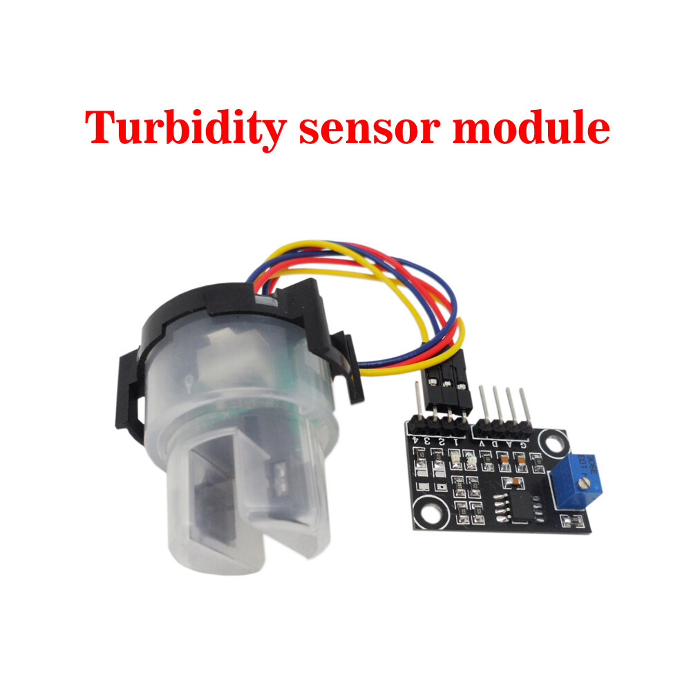

# Turbidity Sensor and Arduino UNO

Turbidity sensor for water quality with LCD Screen and Arduino UNO.

<picture>
  
</picture>

Watch the implementation of this code on our [YouTube channel](https://www.youtube.com/@Roboticxps)

To get your own Turbidity Sensor, visit our online store: (Product Page)

https://roboticx.ps/product/analog-turbidity-sensor-for-arduino/

----

Follow us on social media:

* Facebook: https://www.facebook.com/Roboticxps
* Instagram: https://www.instagram.com/roboticx.ps
* YouTube: https://www.youtube.com/@Roboticxps
* LinkedIn: https://www.linkedin.com/company/roboticx
